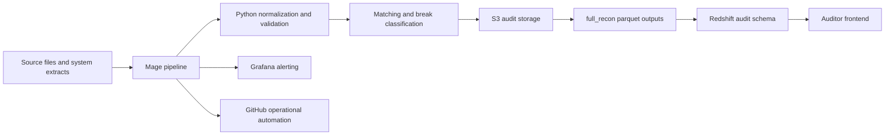

# Mage Reconciliation Automation

## Summary

This project documents a sanitized version of a reconciliation automation pattern built with Mage, Python, S3, parquet, Redshift, Grafana, and GitHub automation.

The goal was to replace repetitive daily review work with a rerunnable, observable, and auditable process. Sensitive company names, schemas, account IDs, credentials, transaction identifiers, and internal URLs have been removed or replaced with mock examples.

## Business Problem

Financial reconciliation was taking too long to operate and too long to extend.

- Daily review required about **2 hours** of manual work.
- Creating a new reconciliation required about **3 hours** of setup.
- Evidence existed across files, code, and manual checks.
- Auditors needed status visibility without reading pipeline code.

## Outcome

- Daily reconciliation review went from about **2 hours to 15 minutes**.
- New reconciliation setup went from about **3 hours to 1 hour**.
- Each run produced audit-ready outputs and durable storage artifacts.
- Full reconciliation parquet outputs fed a downstream Redshift schema.
- A separate frontend exposed transaction status history for audit and operations teams.

## Architecture



## Pipeline Flow

1. Ingest source extracts and reconciliation inputs.
2. Normalize schemas, dates, amounts, identifiers, and file metadata.
3. Run deterministic matching rules.
4. Classify matched records, unmatched records, carry-forward breaks, and resolved breaks.
5. Export run-level evidence to S3.
6. Write `full_recon` parquet outputs for downstream audit consumption.
7. Load reconciliation history into Redshift through a separate ingestion pipeline.
8. Expose status changes in a frontend so auditors can inspect transactions without reading code.

## S3 Storage Mockup

```text
s3://reconciliation-audit-platform/
  reconciliations/
    <reconciliation_name>/
      runs/
        run_date=YYYY-MM-DD/
          run_id=<uuid>/
            input/
              source_a.csv
              source_b.csv
            normalized/
              source_a.parquet
              source_b.parquet
            outputs/
              matched.parquet
              breaks.parquet
              full_recon.parquet
            manifests/
              run_manifest.json
              validation_summary.json
```

## Audit Model

The important design choice is that the final output is not only a daily result. It is a historical status model.

```text
transaction_id | reconciliation_date | status        | status_reason       | first_seen_at | last_seen_at
txn_001        | 2026-09-28          | matched       | amount_date_match   | 2026-09-28    | 2026-09-28
txn_002        | 2026-09-28          | open_break    | missing_external    | 2026-09-28    | 2026-09-29
txn_002        | 2026-09-29          | resolved      | matched_next_day    | 2026-09-28    | 2026-09-29
```

This lets auditors answer:

- What was the status of a transaction on a specific day?
- When did a break first appear?
- When was it resolved?
- Did the same transaction change status across multiple runs?
- Which run produced the evidence?

## Grafana And GitHub Tokens

No tokens or secrets belong in the repository.

The production pattern uses secret-managed environment variables for:

- **Grafana / OnCall token:** send failure alerts, stale-run alerts, or operational incidents.
- **GitHub token:** trigger controlled automation, read workflow metadata, or attach run evidence when needed.
- **Cloud credentials:** write only to the approved S3 prefixes and read only the required sources.

Recommended public documentation pattern:

```text
GRAFANA_ONCALL_TOKEN=<stored in secret manager>
GITHUB_AUTOMATION_TOKEN=<stored in secret manager>
AWS_ROLE_ARN=<runtime role, not a static access key>
```

## Recruiter Notes

This project is intentionally documented as a case study instead of a code dump. The value is in the system design:

- manual work reduced with automation;
- reconciliation outputs made explainable;
- evidence stored durably;
- alerts connected to operational ownership;
- audit teams served through data products instead of code review.

## What Is Public

- Sanitized architecture.
- Mock storage layout.
- Mock transaction status table.
- Business impact.
- Engineering tradeoffs.

## What Is Not Public

- Real company data.
- Production schemas.
- Internal URLs.
- Credentials, tokens, roles, or account IDs.
- Exact matching rules that expose internal controls.
